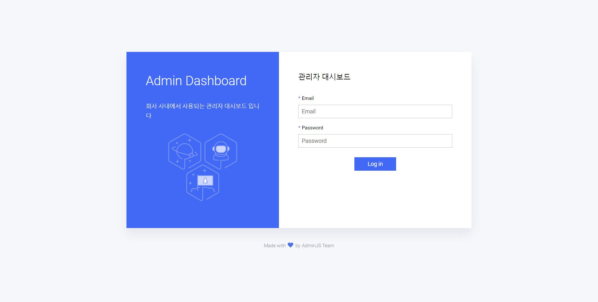
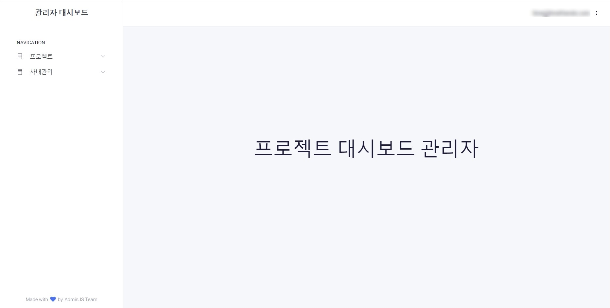
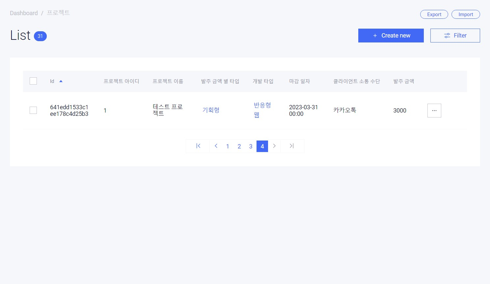
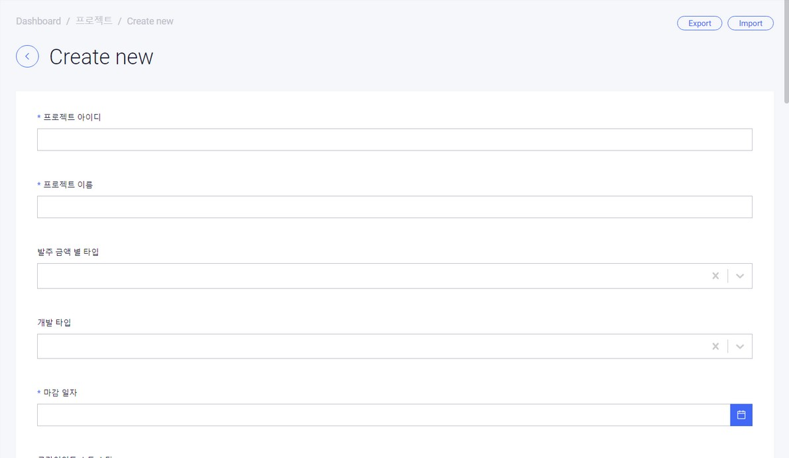
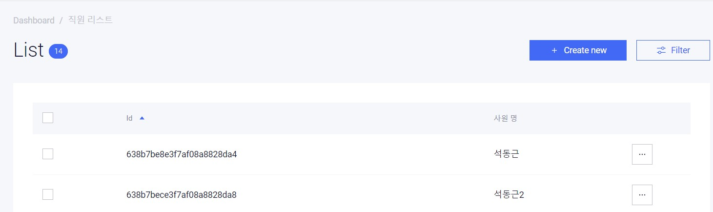
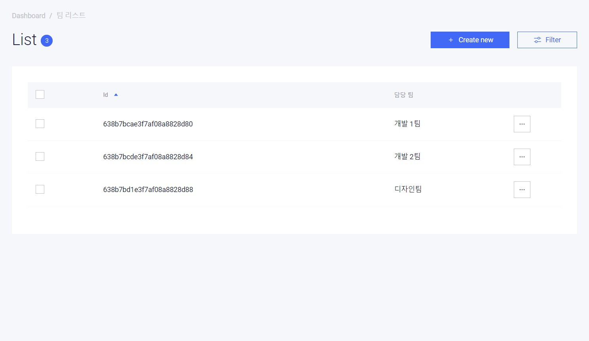
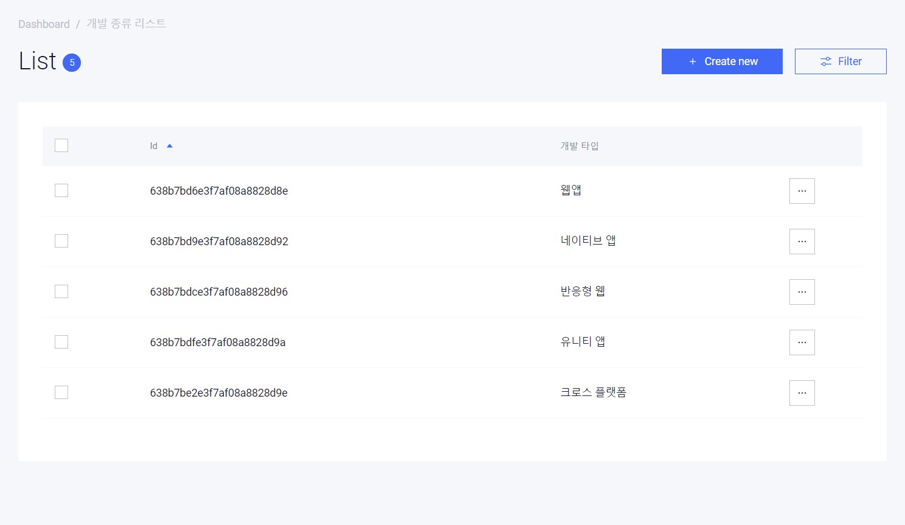

# 사내관리 대시보드
> 프로젝트, 직원, 팀, 개발 종류, 발주 타입, 비품 관리를 지원합니다.


<br/>


# ✨ 서비스 페이지
서비스 종료 : ~~[https://project.donggeun.co.kr](https://project.donggeun.co.kr)~~


<br/>


# 🌿 사용 스택

### Languages


### Frameworks & Library


### Database


### Cloud


<br/>


# 📚 아키텍쳐
## Admin Folder Architecture

```
📂 admin
├── 📂 components
│   └── dashboard.jsx # 대시보드에서 사용되는 컴포넌트
├── 📂 locales        # 지역화 정의
├── 📂 resources      # 리소스 지역화 및 옵션 코드
├── admin.module.ts   # 모듈 파일
└── admin.ts          # 대시보드 페이지의 옵션(대시보드 이름, 로고, 관리자 Path...) 설정
```

## Module Folder Architecture

```
📂 test
├── test.module.ts   # 모듈 파일
└── test.schema.ts   # 스키마 파일
```


<br/>

# 💻화면 구성

|  |  |
| :---------------------------: | :----------------------------: |
|            로그인             |            메인화면            |

|  |  |
| :----------------------------: | :-----------------------------------: |
|            프로젝트            |             프로젝트 생성             |

|  |  |
| :-------------------------------: | :---------------------------: |
|             직원 메뉴             |            팀 메뉴            |

|  |  |
| :-------------------------------------: | :---------------------------------------: |
|             개발 종류 메뉴              |            발주 금액 타입 메뉴            |


<br/>


# 📢 해결한 이슈 & 알게된 것
  - [adminjs에서 Add new item을 클릭 시 items.map is not a function에러](https://github.com/tjrehdrms123/TIL/blob/main/study/JS/Node.js/Nest.js/Error/items.map%20is%20not%20a%20functio.md)
  - [Nestjs With Adminjs Mongoose Error given id: "types"](https://github.com/tjrehdrms123/TIL/blob/main/study/JS/Node.js/Nest.js/Error/Nestjs%20With%20Adminjs%20Mongoose%20Error%20given%20id%20types.md)